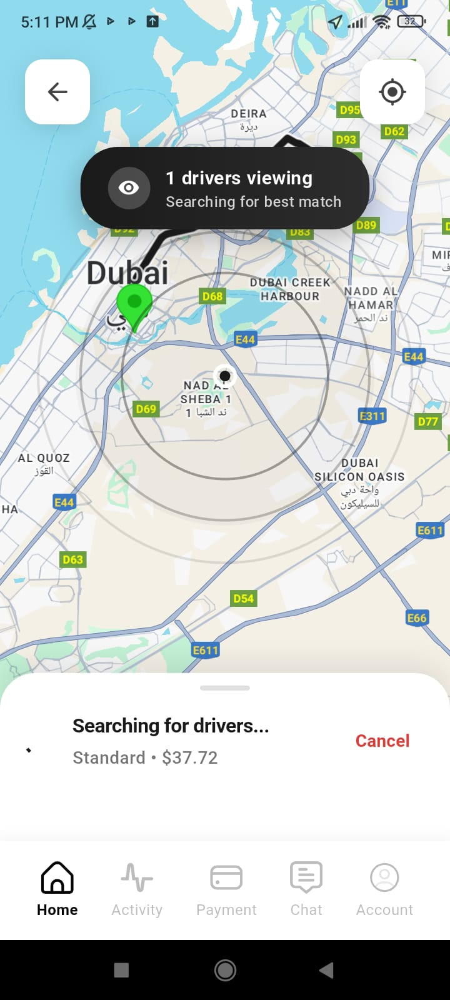
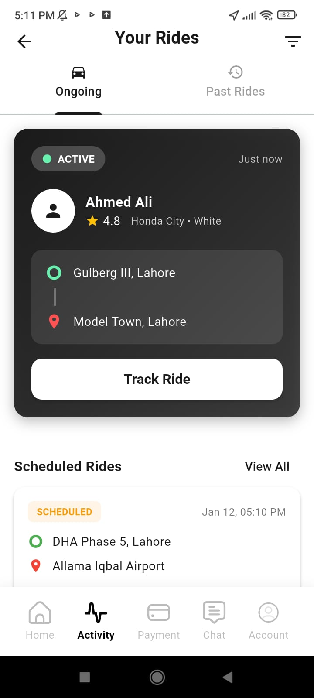
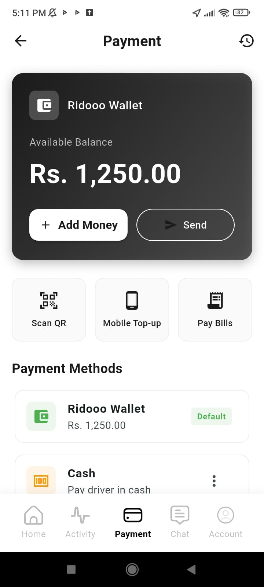
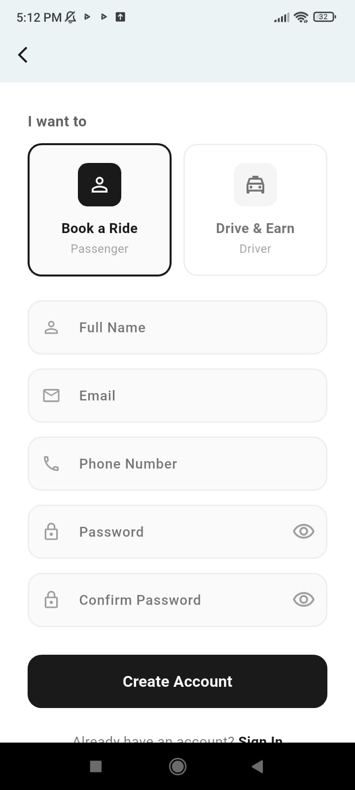
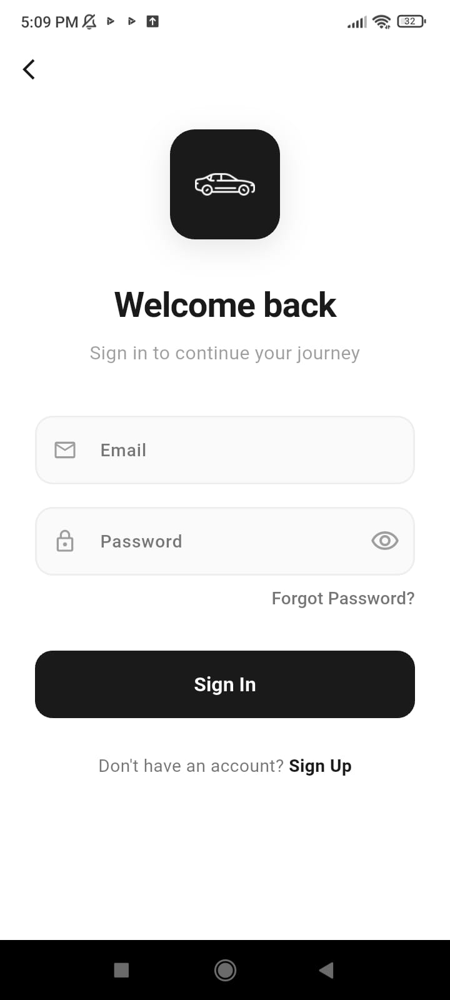
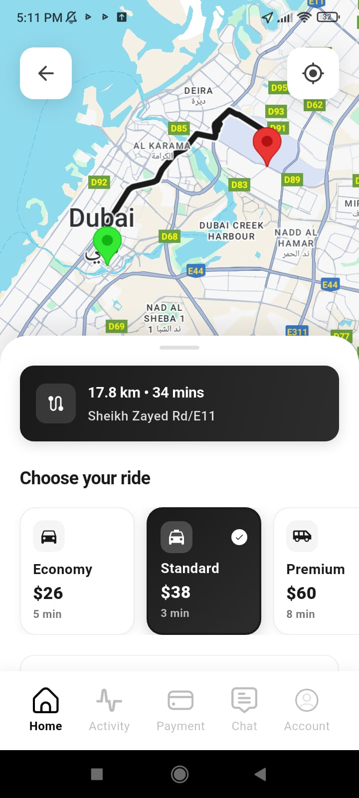

<div align="center">

# 🚗 Ridooo

### Your Smart Ride-Sharing Companion

[](https://flutter.dev)
[](https://dart.dev)
[](https://supabase.com)

A modern, feature-rich ride-sharing platform built with Flutter and Supabase

---

</div>

## 📱 Overview

**Ridooo** is a comprehensive ride-sharing platform that brings convenience to your fingertips. Built with cutting-edge technology, it offers seamless transportation solutions with real-time tracking, secure authentication, and an intuitive user interface.

## ✨ Features

| Category | Features |
|----------|----------|
| 🔐 **Authentication** | Secure login, email verification, protected sessions |
| 🗺️ **Navigation** | Real-time GPS tracking, Google Maps integration, live tracking |
| 🚕 **Ride Management** | Quick booking, multiple vehicle options, ride history |
| 💳 **Payments** | Secure processing, digital receipts, driver ratings |
| 🔔 **Notifications** | Push notifications, trip status updates |

## 🛠️ Tech Stack

| Technology | Purpose |
|------------|---------|
|  | Frontend Framework |
|  | Backend & Database |
|  | Maps & Location |
|  | Programming Language |

**Architecture:** Clean Architecture with Dependency Injection

---

## 📸 Screenshots

<div align="center">

  

  



</div>

---

## 📋 Prerequisites

- Flutter SDK (^3.7.0)
- Dart SDK (^3.7.0)
- Android Studio / VS Code
- Git
- [Supabase Account](https://supabase.com)
- [Google Cloud Console](https://console.cloud.google.com) (for Maps API)

## 🚀 Installation

**Step 1: Clone the Repository**
```bash
git clone https://github.com/JunaidJamshid123/Ridooo.git
cd ridooo
```

**Step 2: Install Dependencies**
```bash
flutter pub get
```

**Step 3: Configure Supabase**
1. Create a new project at [supabase.com](https://supabase.com)
2. Run the schema file: `supabase_complete_schema_v2.sql`
3. Update your Supabase credentials in the project

**Step 4: Configure Google Maps**
1. Get your API key from [Google Cloud Console](https://console.cloud.google.com)
2. Add the API key to:
   - Android: `android/app/src/main/AndroidManifest.xml`
   - iOS: `ios/Runner/AppDelegate.swift`

**Step 5: Run the Application**
```bash
flutter run
```

---

## 📁 Project Structure

```
lib/
├── core/                    # Core utilities & constants
├── features/                # Feature modules
│   ├── auth/               # Authentication
│   ├── ride/               # Ride management
│   └── profile/            # User profiles
├── injection_container.dart # Dependency injection
├── main.dart               # App entry point
└── splash_screen.dart      # Splash screen
```

## ⚙️ Environment Setup

| Platform | Command |
|----------|---------|
| Windows | `.\setup.ps1` |
| macOS/Linux | `./setup.sh` |

## 📦 Build Commands

| Platform | Command |
|----------|---------|
| Android APK | `flutter build apk --release` |
| iOS | `flutter build ios --release` |

---

## 🤝 Contributing

1. Fork the project
2. Create your feature branch: `git checkout -b feature/NewFeature`
3. Commit your changes: `git commit -m 'Add NewFeature'`
4. Push to the branch: `git push origin feature/NewFeature`
5. Open a Pull Request

## 📄 License

This project is licensed under the MIT License.

## 💬 Support

For support and queries, please [open an issue](https://github.com/JunaidJamshid123/Ridooo/issues).

---

<div align="center">

⭐ **Star this repository if you found it helpful!**

Made with ❤️ using Flutter

</div>
